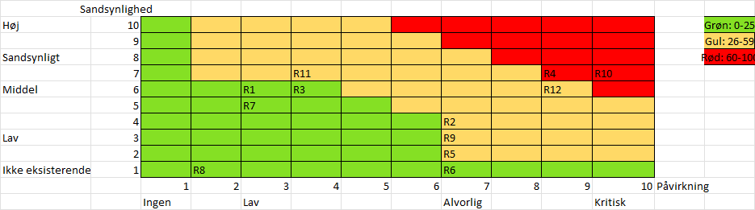

# Risk Assessment

## Technical Risks

| ID | Name                                   | Description                                                       | Impact | Likelihood | Risk Factor | Preventive Actions                                | Status    | Status Date | Follow-up Date |
|----|----------------------------------------|-------------------------------------------------------------------|--------|------------|-------------|---------------------------------------------------|-----------|-------------|----------------|
| R1 | Minor challenges with new technologies | Limited time to learn various technologies                        | 3      | 6          | 18          | Training, experiment before development           | Initial   | 25-11-2025  | 01-12-2025     |
| R2 | Major challenges with new technologies | Fundamental misuse of technology hindering project development    | 7      | 4          | 28          | Training, experiment before development           | Initial   | 25-11-2025  | 01-12-2025     |
| R3 | DevOps/Deployment issues               | Network/configuration errors in infrastructure or CI/CD pipelines | 4      | 6          | 24          | Use Infrastructure-as-Code for quick redeployment | Initial   | 25-11-2025  | 01-12-2025     |
| R4 | Insufficient test coverage             | Few or no automated tests, increasing risk of errors              | 9      | 7          | 63          | Agree on TDD or code-first development            | Initial   | 25-11-2025  | 01-12-2025     |
| R1 | Minor challenges with new technologies | Limited time to learn various technologies                        | 3      | 5          | 15          | Training and practical experience                 | Follow-up | 01-12-2025  | 15-12-2025     |
| R2 | Major challenges with new technologies | Fundamental misuse of technology hindering project development    | 7      | 3          | 21          | Training and practical experience                 | Follow-up | 01-11-2025  | 15-12-2025     |
| R3 | DevOps/Deployment issues               | Network/configuration errors in infrastructure or CI/CD pipelines | 4      | 2          | 8           | Improved documentation and automation             | Follow-up | 01-12-2025  | 15-12-2025     |
| R4 | Insufficient test coverage             | Few or no automated tests, increasing risk of errors              | 9      | 4          | 36          | Reconsider using TDD                              | Follow-up | 01-12-2025  | 15-12-2025     |

## Business Risks

| ID  | Name                           | Description                                                                                                                  | Impact | Likelihood | Risk Factor | Preventive Actions                                                                          | Status   | Status Date | Follow-up Date |
|-----|--------------------------------|------------------------------------------------------------------------------------------------------------------------------|--------|------------|-------------|---------------------------------------------------------------------------------------------|----------|-------------|----------------|
| R5  | Scope creep                    | Project scope expands                                                                                                        | 7      | 2          | 14          | Update backlog, add more sprints                                                            | Initial  | 25-11-2025  | 01-12-2025     |
| R6  | Developer illness              | Illness during flu season                                                                                                    | 7      | 1          | 7           | Hire more, enable remote work                                                               | Initial  | 25-11-2025  | 01-12-2025     |
| R7  | Wrong priorities               | Focus on features with little business value (UI/UX)                                                                         | 3      | 5          | 15          | Extreme programming, keep customer close                                                    | Initial  | 25-11-2025  | 01-12-2025     |
| R8  | Supervisor unavailable         | Supervisor sick or overbooked                                                                                                | 2      | 1          | 2           | Updated Scrum board, detailed tasks                                                         | Initial  | 25-11-2025  | 01-12-2025     |
| R9  | Procrastination                | Deadlines missed, work rushed or incomplete                                                                                  | 7      | 3          | 21          | Assign smaller, simpler tasks                                                               | Initial  | 25-11-2025  | 01-12-2025     |
| R10 | Revocation of Residence Permit | Risk that group members lose their legal right to stay due to residence permit withdrawal, reducing team size and continuity | 7      | 4          | 16          | Monitor immigration status regularly, provide legal support, maintain backup staffing plans | Initiate | 02-12-2025  | 01-12-2025     |
| R5  | Scope creep                    | Project scope expands                                                                                                        | 7      | 1          | 7           | Regular backlog reviews                                                                     | Follow-up| 01-12-2025  | 15-12-2025     |
| R6  | Developer illness              | Illness during flu season                                                                                                    | 7      | 1          | 7           | Cross-training team members                                                                 | Follow-up| 01-12-2025  | 15-12-2025     |
| R7  | Wrong priorities               | Focus on features with little business value (UI/UX)                                                                         | 3      | 4          | 12          | daily standup                                                                               | Follow-up| 01-12-2025  | 15-12-2025     |
| R8  | Supervisor unavailable         | Supervisor sick or overbooked                                                                                                | 2      | 1          | 2           | Updated Scrum board, detailed tasks                                                         | Follow-up| 01-12-2025  | 15-12-2025     |
| R9  | Procrastination                | Deadlines missed, work rushed or incomplete                                                                                  | 7      | 2          | 14          | Implement time management techniques                                                        | Follow-up| 01-12-2025  | 15-12-2025     |
| R10 | Revocation of Residence Permit | Risk that group members lose their legal right to stay due to residence permit withdrawal, reducing team size and continuity | 7      | 3          | 21          | Maintain regular communication                                                            | Follow-up| 01-12-2025  | 15-12-2025     |

## Delivery Risks

| ID  | Name                 | Description                            | Impact | Likelihood | Risk Factor | Preventive Actions                    | Status  | Status Date | Follow-up Date |
|-----|----------------------|----------------------------------------|--------|------------|-------------|---------------------------------------|---------|-------------|----------------|
| R10 | Poor time management | Process model/rituals not followed     | 10     | 7          | 70          | Daily Scrum, enforce Scrum meetings   | Initial | 25-11-2025  | 01-12-2025     |
| R11 | Lack of feedback     | No ongoing feedback from stakeholders  | 4      | 7          | 28          | Seek stakeholders, schedule meetings  | Initial | 25-11-2025  | 01-12-2025     |
| R12 | Uneven progress      | Irregular work, no plan for completion | 9      | 6          | 54          | Use burndown charts to track progress | Initial | 25-11-2025  | 01-12-2025     |
| R10 | Poor time management | Process model/rituals not followed     | 10     | 5          | 50          | Enforce Scrum meetings                | Follow-up| 01-12-2025  | 15-12-2025    |
| R11 | Lack of feedback     | No ongoing feedback from stakeholders  | 4      | 5          | 20          | Regular stakeholder meetings          | Follow-up| 01-12-2025  | 15-12-2025    |
| R12 | Uneven progress      | Irregular work, no plan for completion |  9      | 4        | 36          | Improved sprint planning              | Follow-up| 01-12-2025  | 15-12-2025 |

## Risk Matrix

